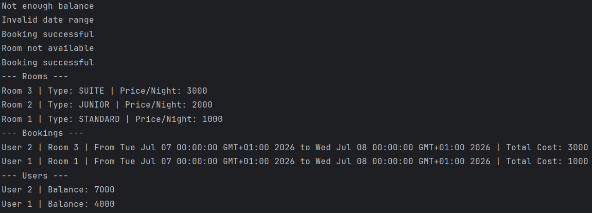

# SkyPay Technical Test

This repository contains two Java-based technical tests demonstrating different programming concepts and design patterns.

## Project Structure

```
test-technique/
├── test_1/          # Banking Account Management System
│   └── src/
│       ├── Main.java
│       ├── acount/
│       │   ├── Account.java
│       │   └── AccountService.java
│       └── transaction/
│           └── Transaction.java
└── test_2/          # Hotel Booking Management System
    └── src/
        ├── Main.java
        ├── classes/
        │   ├── Booking.java
        │   ├── Room.java
        │   └── User.java
        ├── enums/
        │   └── RoomType.java
        ├── service/
        │   └── Service.java
        └── screenshot/
            └── image.png
```

## Test 1: Banking Account Management

A simple banking system that handles:
- Account deposits and withdrawals
- Transaction history tracking
- Account statement generation

### Features
- **Account Management**: Create accounts and manage balances
- **Transaction Processing**: Handle deposits and withdrawals with validation
- **Statement Generation**: Print detailed transaction history

### How to Run
```bash
cd test_1/src
javac Main.java
java Main
```

## Test 2: Hotel Booking Management System

A hotel room booking system that manages rooms, users, and bookings with conflict detection.

### Features
- **Room Management**: Different room types (STANDARD, JUNIOR, SUITE) with pricing
- **User Management**: Users with balance tracking
- **Booking System**: Date-based bookings with conflict detection
- **Dynamic Updates**: Room updates that don't affect existing bookings

### Screenshot


### How to Run
```bash
cd test_2/src
javac Main.java
java Main
```

## Design Questions & Answers

### 1. Service Architecture Design

**Question**: Suppose we put all the functions inside the same service. Is this the recommended approach? Please explain.

**Answer**: No, this is not the recommended approach. To respect the **Single Responsibility Principle** of SOLID design principles, each method should be in a file that is responsible only for its specific functionality.

**Reasoning**:
- **Separation of Concerns**: Each service should handle one specific domain
- **Maintainability**: Smaller, focused classes are easier to maintain and test
- **Scalability**: Separate services can be developed and deployed independently
- **Code Reusability**: Focused services can be reused across different parts of the application

**Better Approach**:
```
service/
├── RoomService.java     # Room management operations
├── UserService.java     # User management operations
└── BookingService.java  # Booking operations and validations
```

### 2. Room Update Strategy

**Question**: In this design, we chose to have a function `setRoom(..)` that should not impact the previous bookings. What is another way? What is your recommendation? Please explain and justify.

**Answer**: I have two recommended solutions to handle room updates without affecting existing bookings:

#### Solution 1: Room Archive Pattern
Create a separate table or entity called `Room_Archive` that contains historical room data:
- When a room is updated, the old room data is moved to `Room_Archive`
- Existing bookings remain linked to the archived room data
- New bookings use the updated room information

**Advantages**:
- Complete historical data preservation
- Clear separation between current and historical data
- Easy to implement audit trails

#### Solution 2: Booking State Management (Recommended)
Implement a state-based system for bookings:
- Add a state field to bookings: `ACTIVE`, `ARCHIVED`, `COMPLETED`
- When a room is updated, existing bookings are marked as `ARCHIVED`
- Create new room entries for future bookings
- Users see updated room information, but historical bookings remain intact

**Advantages**:
- Better data integrity
- Simpler database schema
- More flexible for different business scenarios
- Easier to implement reporting and analytics
